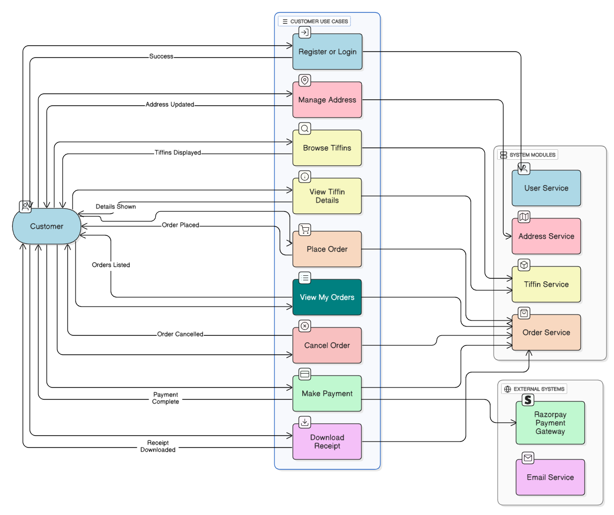
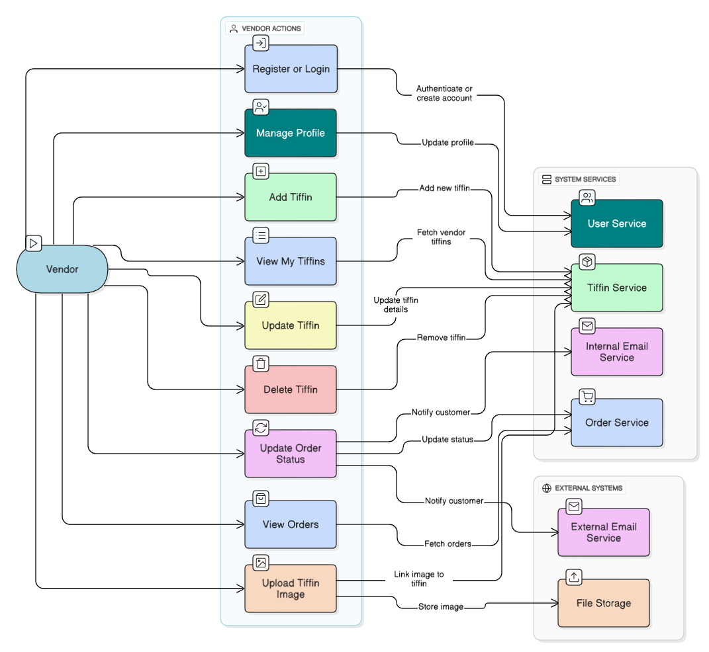
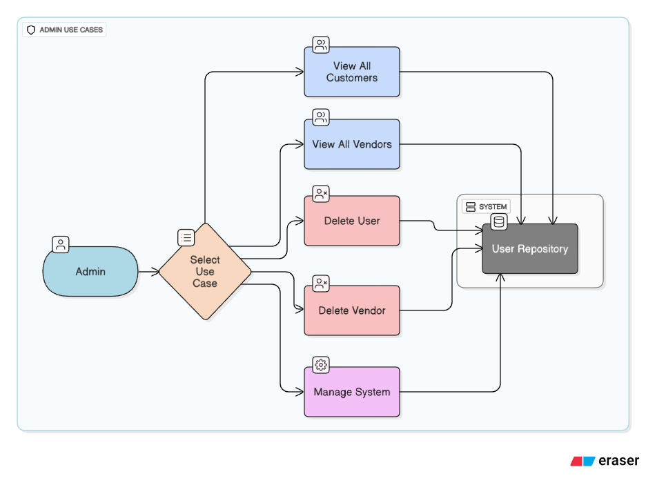
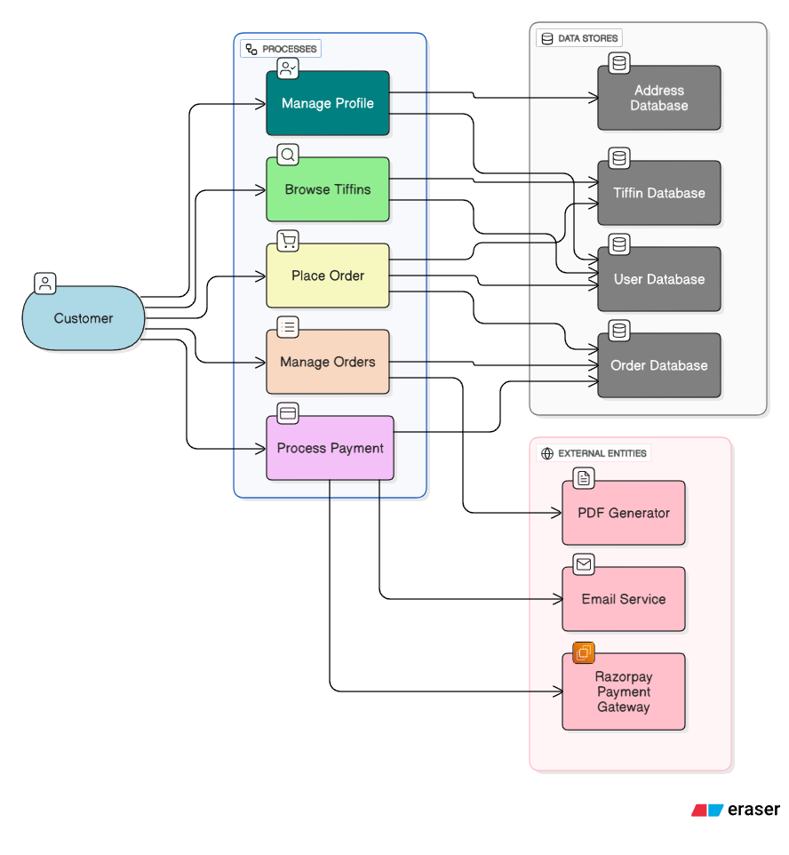
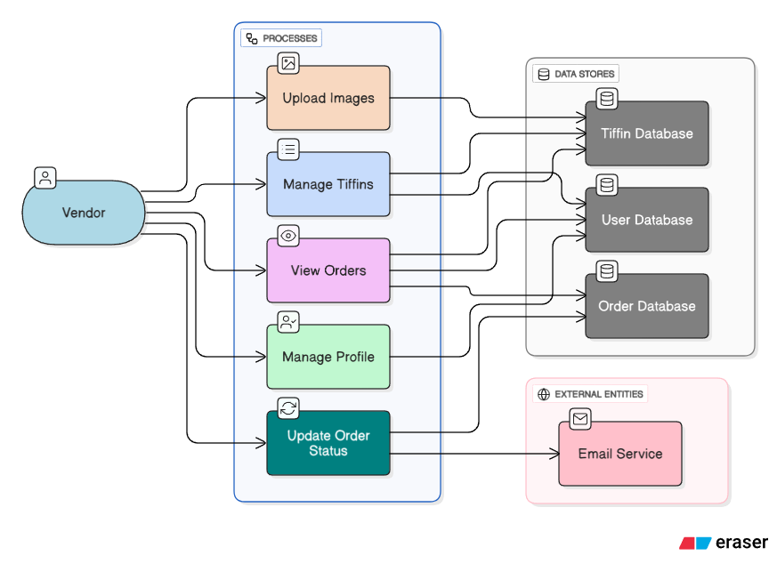
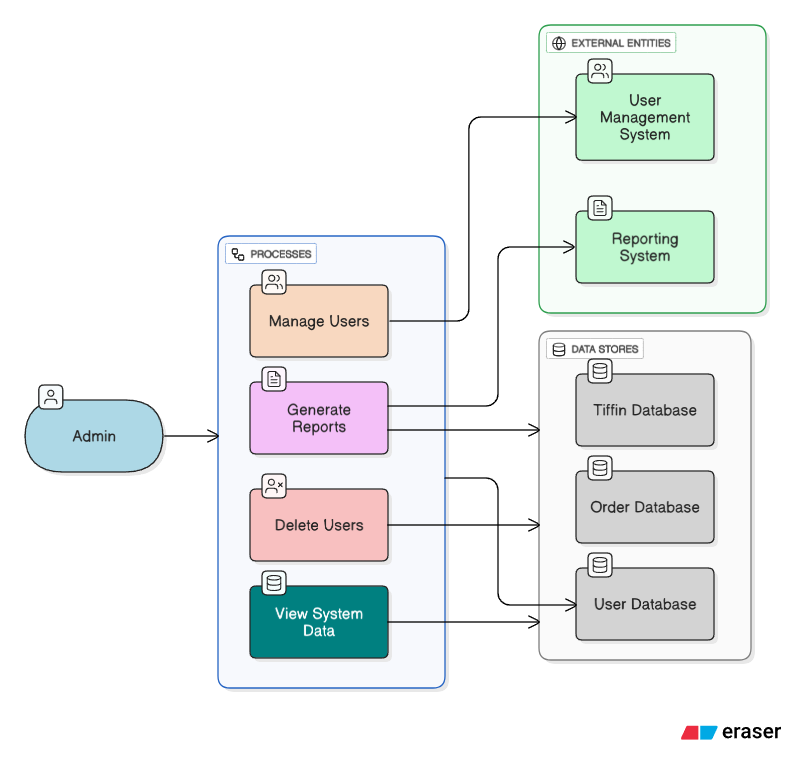

# Annapurna Tiffin Delivery Service - Full Stack

The **Annapurna Tiffin Delivery Service** is a complete web platform for managing online tiffin orders,  
supporting three roles: **Customer**, **Vendor**, and **Admin**.

---

## 🚀 Key Features
- Secure JWT Authentication & Role-based access
- Tiffin browsing, ordering, tracking, and address management
- Vendor menu management & order handling
- Admin oversight for users, vendors, and orders
- Email notifications, receipt downloads, and payment tracking

---

## 🛠 Tech Stack
**Frontend:** React.js (Vite), React Router, Context API, Axios, CSS  
**Backend:** Spring Boot (Java) **or** ASP.NET Core (C#) with JWT, MySQL / SQLite  
**Other:** Spring Security / ASP.NET Identity, Hibernate / EF Core

---

## ⚙ Setup
```bash
# Frontend
npm install && npm run dev

# Spring Boot Backend
mvn spring-boot:run

# ASP.NET Core Backend
dotnet run
```

---

## 📊 Use Case Diagrams

### Customer


### Vendor


### Admin


---

## 🔄 Data Flow Diagrams

### Customer


### Vendor


### Admin


---

## 🗄 Database Schema


---

## 📄 License
MIT License
